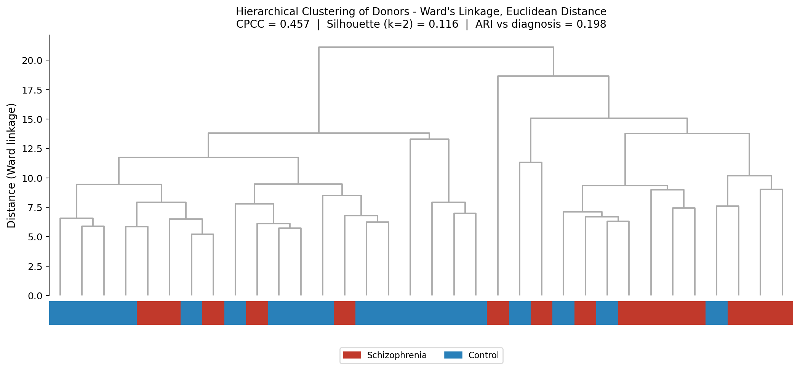
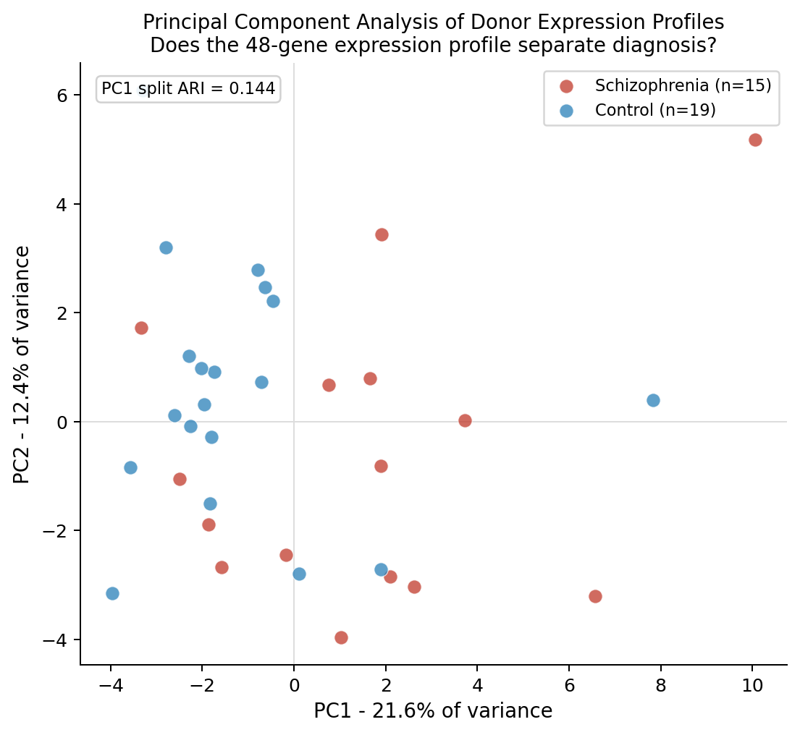
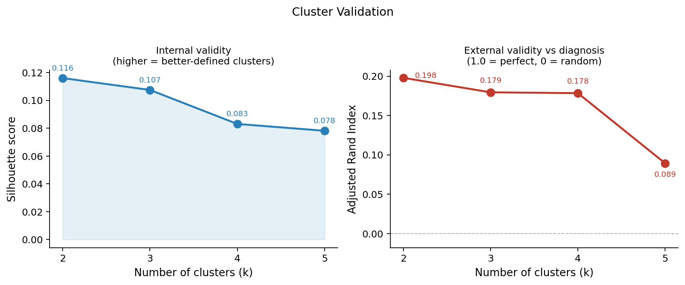
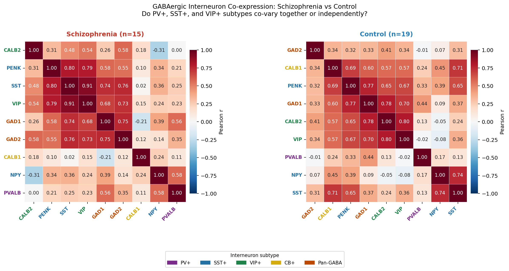
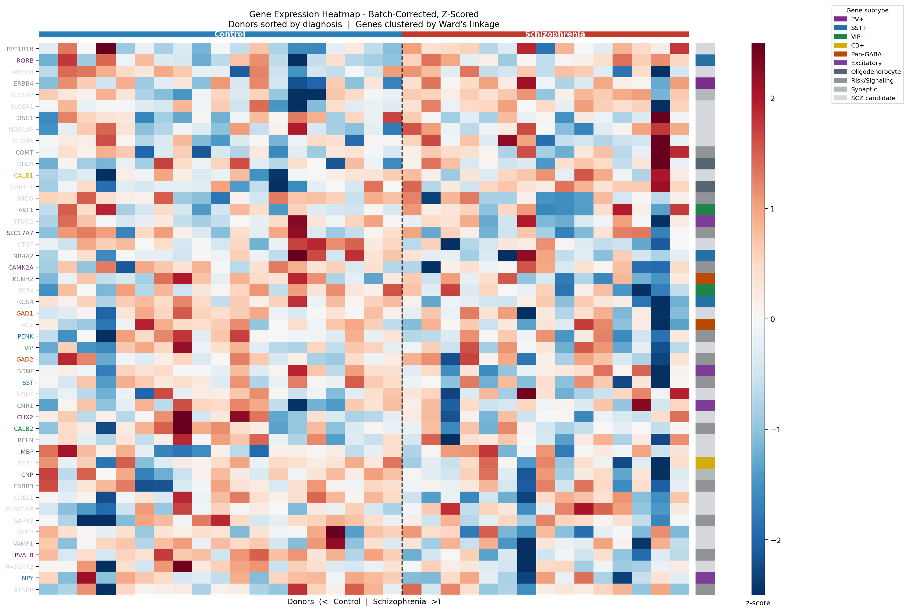
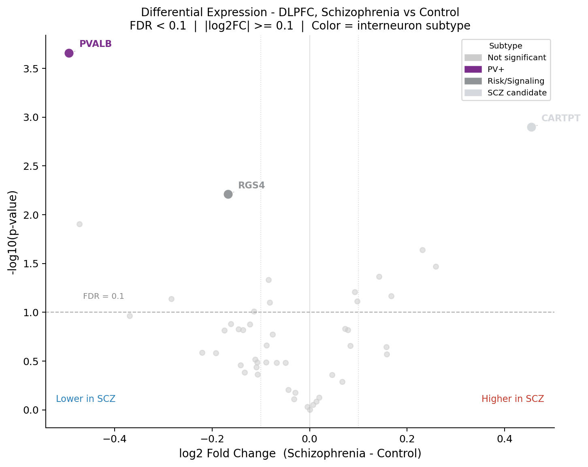
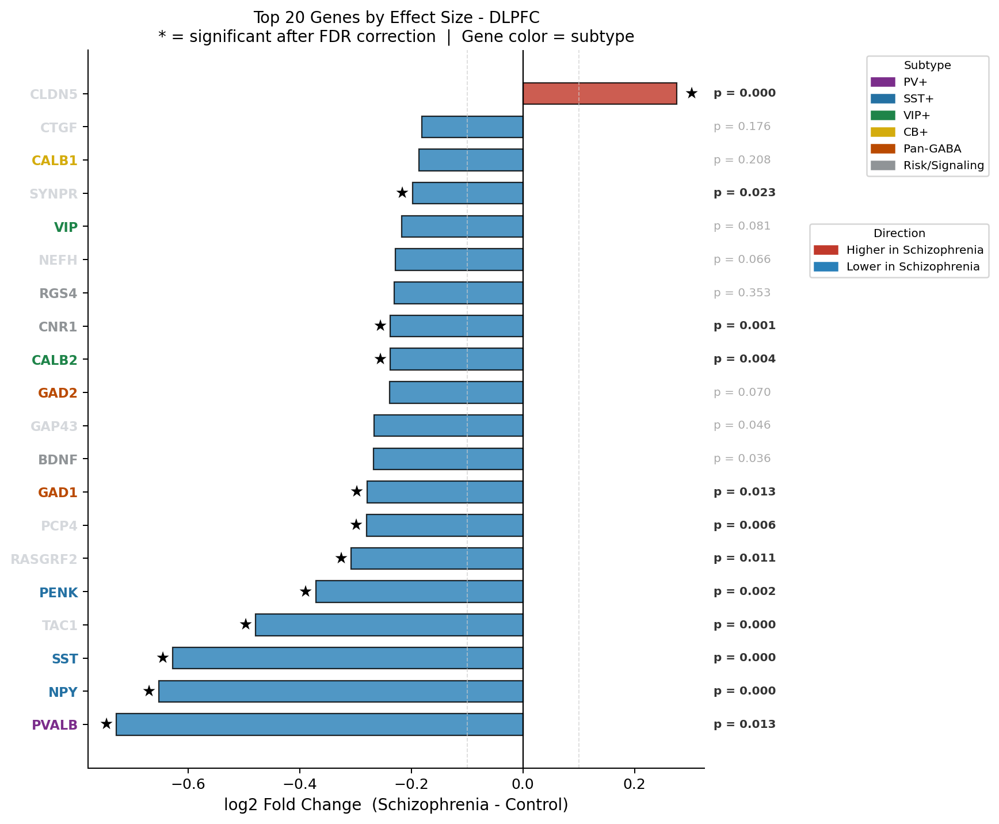
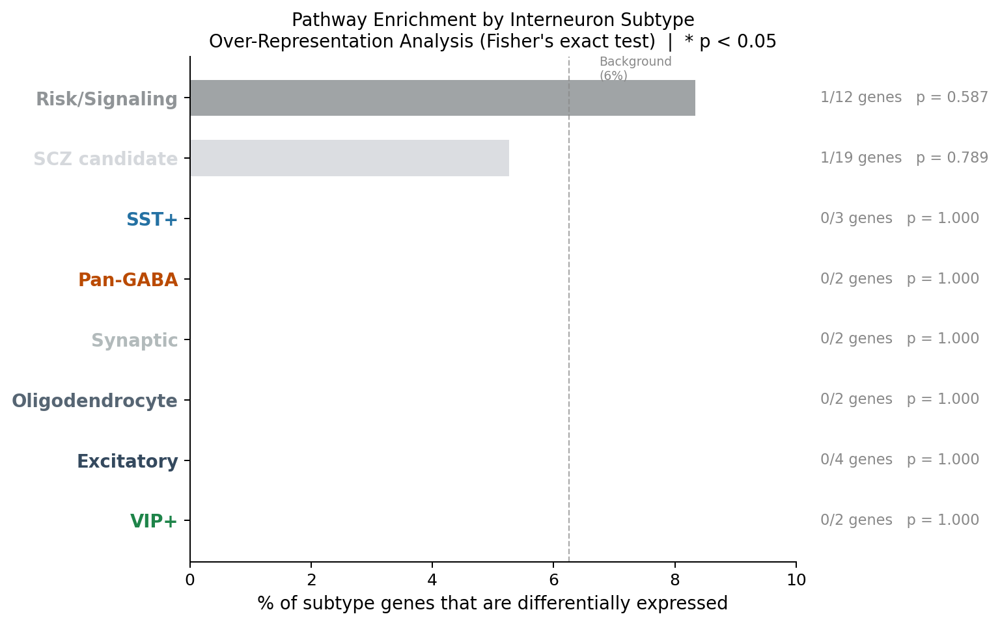

# scz-dlpfc-analysis

**Bioinformatics analysis of GABAergic interneuron gene expression in the dorsolateral prefrontal cortex in schizophrenia**

  

| | |
|---|---|
| **Dataset** | GSE53987 (NCBI GEO): 15 SCZ vs. 19 control postmortem DLPFC donors (n = 34) |
| **DEGs** | 3 genes at FDR < 0.1: PVALB (down, padj = 0.011), RGS4 (down, padj = 0.006, subtype unassigned), CARTPT (up, padj = 0.030) |
| **Clustering** | ARI near 0 -- diagnosis not recovered (expected in postmortem transcriptomics) |
| **Key finding** | Co-expression independence between PV+ and SST+ markers collapses in schizophrenia |

---

## Overview

Using publicly available postmortem brain microarray data (GSE53987, 15 schizophrenia vs. 19 control DLPFC samples, n = 34), I built a four-script Python pipeline to ask whether GABAergic interneuron subtypes show coordinated or independent transcriptional dysregulation in schizophrenia. Unsupervised clustering did not recover diagnosis (an ARI near 0), which is consistent with the postmortem transcriptomics literature.

The more interesting result came from co-expression analysis: the normal functional independence between PV+ and SST+ interneuron markers collapses in schizophrenia, with all markers co-varying as a single module rather than showing subtype-specific patterns. Three genes were significantly differentially expressed (FDR < 0.1): PVALB (PV+, downregulated, padj = 0.011), RGS4 (downregulated, padj = 0.006, subtype unassigned), and CARTPT (upregulated, padj = 0.030). No interneuron subtype reached significance in enrichment analysis at this sample size, consistent with limited statistical power at n = 34. The main limitation is that the analysis uses a curated 48-gene panel rather than an unbiased whole-transcriptome approach, and explicit covariates such as RNA integrity number and postmortem interval were not available for this dataset.


---

## What is this project?

This project applies a reproducible Python analysis pipeline to postmortem brain gene expression data to investigate a specific question about schizophrenia: do the different subtypes of inhibitory neurons in the prefrontal cortex break down together or independently in the disease?

The full pipeline runs in about 15 minutes on any laptop, from raw data download to final figures.

---

## The Biology (plain language first)

### What is schizophrenia, and why the prefrontal cortex?

Schizophrenia is a serious psychiatric disorder affecting about 1% of the global population [1]. It is characterized by three categories of symptoms:

- **Positive symptoms** (things that are added): hallucinations, delusions, disorganized thinking
- **Negative symptoms** (things that are reduced): blunted affect, loss of motivation, social withdrawal
- **Cognitive symptoms**: impaired working memory, difficulty planning, reduced executive function

The cognitive and negative symptoms are the hardest to treat and are most strongly linked to dysfunction of the **dorsolateral prefrontal cortex (DLPFC)**, a region of the frontal lobe that is critical for reasoning, working memory, and executive function [1].

### What are GABAergic interneurons, and why do they matter?

The brain has two broad categories of neurons: excitatory neurons (which activate other neurons) and inhibitory neurons (which suppress activity). Most inhibitory neurons use **GABA** (gamma-aminobutyric acid) as their neurotransmitter, so they are called GABAergic neurons.

A specific class of GABAergic neurons called **interneurons** acts as the brain's local circuit regulators. They control the timing and synchrony of excitatory neuron firing, which is essential for the coordinated neural activity underlying cognition [1, 10]. Without properly functioning interneurons, excitatory circuits become dysregulated, which is thought to contribute directly to the cognitive symptoms of schizophrenia [1, 10].

There are several distinct subtypes of GABAergic interneurons, each with a different shape, location, and role in the circuit [1]:

- **PV+ neurons (parvalbumin-positive)**: Fast-spiking basket and chandelier cells. Basket cells wrap around the soma (cell body) of excitatory neurons; chandelier cells target the axon initial segment, the precise site where action potentials are generated. This gives PV+ neurons powerful control over whether excitatory neurons fire at all.
- **SST+ neurons (somatostatin-positive)**: Martinotti cells that extend long processes to the upper layers of the cortex, targeting the apical dendrites of excitatory neurons. They regulate long-range inputs arriving from other brain regions.
- **VIP+ neurons (VIP-positive)**: A class that primarily targets other interneurons rather than excitatory cells directly. By inhibiting inhibitory neurons, VIP+ cells can effectively disinhibit excitatory circuits.
- **CR+ neurons (calretinin-positive)**: CR+ neurons also largely target other interneurons and are generally considered to be spared in schizophrenia, which is itself a key distinguishing feature of the pathology [1].
- **CB+ neurons (calbindin-positive)**: A calcium-binding protein marker expressed in a subset of interneurons, including some SST+ cells in the DLPFC. Used as a co-expression marker in this analysis; largely overlaps with SST+ in cortical layers II-III [1, 10].

PV+ and SST+ interneurons both originate from the medial ganglionic eminence (MGE) during neurodevelopment, making them potentially vulnerable to shared developmental disruptions, whereas CR+ neurons originate from the caudal ganglionic eminence (CGE) and follow a distinct trajectory [1].

### What does the postmortem literature say?

Decades of postmortem studies consistently find reduced expression of GABAergic interneuron markers in the DLPFC of people with schizophrenia [1, 2, 10]. Key findings include:

- Reduced **GAD1** (GAD67) mRNA, encoding the primary enzyme that synthesizes GABA from glutamate. This is one of the most replicated molecular findings in schizophrenia research [1, 2].
- Reduced **PVALB** (parvalbumin) expression, particularly in the deep cortical layers [1, 2].
- Reduced **SST** (somatostatin) mRNA, also highly replicated across independent cohorts [1, 2].
- Importantly, the overall density of interneurons, measured by pan-interneuron markers such as GAD1 at the cellular level, is not reduced [2]. The problem appears to be a downregulation of gene expression within surviving cells, not cell death.

These findings are consistent with the GABAergic hypothesis of schizophrenia, which proposes that reduced cortical inhibition contributes to prefrontal dysfunction and cognitive symptoms [1, 10].

### The open question this project addresses

If PV+, SST+, and VIP+ interneurons are all affected in schizophrenia, does this happen in a coordinated way, or do the subtypes show independent patterns? Whether this reflects a general failure of cortical inhibition or something more targeted to specific circuit elements is an open question with real implications for understanding the disease [1].

---

## Research Questions

**Primary:** Do the expression profiles of GABAergic interneuron subtype markers (PV+, SST+, VIP+) in postmortem DLPFC co-vary as a coordinated block in schizophrenia, or do subtypes show independent patterns of dysregulation?

**Secondary:** Does unsupervised hierarchical clustering of the gene panel recover donor diagnosis (schizophrenia vs. control) without using the diagnostic label as input, and are differentially expressed genes enriched in specific interneuron subtype categories?

---

## Data

Gene expression data were obtained from **NCBI GEO accession GSE53987** [3].

GEO (Gene Expression Omnibus) is a public repository maintained by NCBI where researchers deposit their gene expression datasets so that anyone can download and reanalyze them freely [8]. This is the foundation of reproducible science in genomics.

| Field | Value |
|---|---|
| GEO Accession | GSE53987 |
| Platform | GPL570 (Affymetrix Human Genome U133 Plus 2.0 Array) |
| Tissue | Postmortem prefrontal cortex (Brodmann Area 46), striatum, hippocampus |
| Groups | Schizophrenia, bipolar disorder, major depressive disorder, matched controls |
| Total samples | 205 |
| Used in this analysis | 15 SCZ + 19 Control DLPFC samples (n = 34) |

The dataset uses **Affymetrix microarrays**, a technology that measures the expression level of thousands of genes simultaneously by hybridizing labeled RNA to short DNA probes on a chip. Each probe has a known sequence that binds its complementary target RNA, and the fluorescence intensity of the resulting signal indicates how much of that RNA is present in the sample.

**Note on data source:** This project was originally designed around the Allen Brain Atlas Human ISH Schizophrenia Study (Guillozet-Bongaarts et al. 2014 [2]), which profiled 58 genes by in situ hybridization in DLPFC tissue from 19 SCZ donors and 33 controls. In situ hybridization (ISH) labels RNA directly within tissue sections, allowing you to see which cells express a gene and at what density. The Allen Brain Atlas ISH REST API is no longer operational [4]. GSE53987 was selected as the replacement because it covers the same brain region, the same diagnostic comparison, and an overlapping gene set, with the additional advantage that Affymetrix microarray provides continuous quantitative signal across all probes simultaneously.

**Gene panel:** 48 of the 58 target genes from Guillozet-Bongaarts et al. were present on the GPL570 platform and used in analysis. CHRNA7 and PRODH were absent from the platform and excluded; 8 additional genes from the source panel were not carried forward into TARGET_GENES.

---

## Pipeline Overview

Four Python scripts run in sequence. Every output is fully reproducible from the raw GEO download.

```
01_fetch_geo.py   -->   02_preprocess.py   -->   03_cluster_analysis.py   -->   04_pathway_analysis.py
  Download               Filter, normalize        Clustering, PCA,               Differential
  GSE53987               expression data           co-expression                  expression,
  from NCBI GEO          (DLPFC only)              heatmaps                       enrichment
```

### What each step does

**Step 1: Data retrieval**
Downloads the full GSE53987 SOFT file directly from NCBI via HTTPS. The SOFT (Simple Omnibus Format in Text) format is a plain-text file containing all sample metadata and expression values for the dataset [8]. A custom parser extracts expression values and maps Affymetrix probe IDs to gene symbols using the platform annotation table. For genes with multiple probes, the probe with the highest mean expression is selected.

**Step 2: Preprocessing**
Filters to schizophrenia and control DLPFC donors only (bipolar disorder and MDD donors, and hippocampus and striatum samples, are excluded here). Log2 transforms expression values and z-score normalizes per gene across donors.

*Batch correction:* After filtering to DLPFC samples only, all 34 donors fall within a single processing cohort (GSM1304xxx prefix). No batch effect was detectable and no correction was applied. The batch effect previously observed in the full 205-sample dataset reflected biological differences between brain regions (DLPFC, hippocampus, striatum), not a technical processing artifact within DLPFC.

*Log2 transformation:* Microarray intensity values are right-skewed. Log2 transformation compresses the range and makes fold-changes interpretable: a difference of 1 unit on the log2 scale corresponds to a twofold change in expression.

*Z-scoring:* Each gene is normalized to mean = 0 and standard deviation = 1 across all donors. This puts all genes on a common scale so that clustering is not dominated by highly expressed genes.

**Step 3: Cluster analysis**
Applies Ward's linkage hierarchical clustering to donors, runs PCA to assess diagnosis separation, computes GABAergic co-expression matrices for SCZ and Control separately, and validates clusters using silhouette score, Adjusted Rand Index, and cophenetic correlation coefficient [9].

**Step 4: Differential expression and pathway enrichment**
Welch's t-test per gene with Benjamini-Hochberg FDR correction [7], followed by over-representation analysis using Fisher's exact test against manually curated interneuron subtype gene sets [6].

---

## Results

### Does unsupervised clustering recover diagnosis?

**Short answer: No. This is the expected and honest result.**



This dendrogram shows the result of hierarchical clustering of all 34 DLPFC donors based solely on their gene expression profiles, with no knowledge of diagnosis. Each leaf at the bottom is one donor; the color bar shows their actual diagnosis (red = schizophrenia, blue = control). The height at which two branches merge indicates how dissimilar those donors are.

If gene expression reliably distinguished schizophrenia from controls, we would expect two large clusters, one mostly red and one mostly blue. Instead, the colors are intermixed throughout. The Adjusted Rand Index (ARI = -0.008) quantifies this: ARI of 1.0 would mean perfect recovery of diagnosis; ARI near 0 means the clustering is no better than random with respect to diagnosis.

This is consistent with a well-established finding in postmortem brain transcriptomics: technical variables like RNA quality and postmortem interval, along with biological covariates like age and medication history, typically explain more expression variance than disease status does [5]. It is not a pipeline failure; it is an accurate result about the nature of postmortem data, and reporting it honestly matters.



Principal Component Analysis (PCA) is a dimensionality reduction technique that finds the directions of greatest variance in a high-dimensional dataset [9]. Here, each dot is one donor projected onto the first two principal components. If diagnosis were the dominant signal, SCZ (red) and Control (blue) donors would separate along one of these axes. They do not: the two groups are interleaved, confirming the clustering result. Note: the 42% PC1 variance figure reported in an earlier version of this analysis reflected a dataset that inadvertently included hippocampus and striatum samples; this PCA uses DLPFC-only data.



Cluster validation across k = 2 to 5 clusters. The left panel shows silhouette score, a measure of internal validity describing how well-separated the clusters are from each other [9]. The right panel shows ARI vs diagnosis (external validity). Internal validity is modest but real. External validity remains near zero across all values of k.

---

### What happens to GABAergic co-expression structure?

**This is the most interesting result in the project.**



This figure shows Pearson correlation matrices for all pairwise combinations of GABAergic interneuron markers, computed separately for schizophrenia donors (left) and control donors (right). Each cell shows the correlation coefficient between two genes across all donors in that group. Red = positive correlation (both genes tend to go up and down together); blue = negative correlation. Gene labels are colored by subtype: purple = PV+, blue = SST+, green = VIP+, yellow = CB+, orange = Pan-GABA.

**In controls (right panel):** PVALB (purple, PV+) is relatively independent of the other markers. Its correlations with CALB1, NPY, and PENK range from roughly -0.30 to 0.35, close to zero. This makes biological sense: PV+ and SST+ interneurons serve distinct functional roles [1].

**In schizophrenia (left panel):** that independence is directionally reduced. In the SCZ group (n = 15), PVALB shows elevated correlations with GAD1 (r = 0.56), NPY (r = 0.58), and SST (r = 0.25) relative to controls, and all markers shift toward co-varying together [10].

**What this means:** In healthy cortex, PV+ and SST+ interneurons maintain relatively independent expression profiles, reflecting their distinct functional roles. In schizophrenia, that separation collapses and all GABAergic markers rise and fall together, pointing to coordinated rather than subtype-specific dysregulation, and directly addressing Research Question 1.

---

### Which specific genes are differentially expressed?



This heatmap shows z-scored expression for all 48 genes across all 34 DLPFC donors. Donors are sorted by diagnosis (Control on the left, Schizophrenia on the right); the dashed vertical line marks the boundary. Genes are clustered by Ward's linkage. Gene labels are colored by subtype. The color of each cell represents the z-score: red = higher than average expression for that gene, blue = lower than average. A shift toward blue in the SCZ half is most visible for PVALB, with SST, NPY, and PENK showing trends that do not survive FDR correction at n = 34.



A volcano plot is a standard visualization for differential expression results. The x-axis shows the log2 fold-change (negative = lower in SCZ, positive = higher in SCZ). The y-axis shows -log10(p-value): higher points are more statistically significant. The dashed horizontal line marks the FDR threshold. Colored points are significant; gray points did not pass the thresholds. Gene labels are colored by subtype.

3 genes were significant at FDR < 0.1, |log2FC| >= 0.1 [7]: PVALB (PV+, downregulated), RGS4 (downregulated), and CARTPT (upregulated). CARTPT encodes a neuropeptide (cocaine- and amphetamine-regulated transcript) with roles in energy homeostasis and stress response; its upregulation in SCZ DLPFC warrants further investigation and does not fit cleanly into the GABAergic downregulation narrative. The reduced DEG count relative to the 15 reported in an earlier version of this analysis reflects the correction of a sample selection error; the earlier run pooled DLPFC, hippocampus, and striatum samples together.

*Note on thresholds:* The thresholds used here (FDR < 0.1, |log2FC| >= 0.1) are more permissive than typical genome-wide standards (FDR < 0.05, |log2FC| >= 0.5). This is appropriate for a curated 48-gene panel: testing 48 genes carries far less multiple testing burden than a genome-wide screen of ~20,000 genes [6, 7].



The top 20 genes ranked by absolute effect size (|log2FC|), sorted from most negative at the bottom to most positive at the top. Stars mark genes significant after FDR correction [7]. Raw p-values are shown in the right margin. Blue bars = lower in schizophrenia; red = higher in schizophrenia. PVALB, NPY, SST, PENK, and GAD1 all show consistent downregulation, consistent with the findings of Guillozet-Bongaarts et al. (2014) [2].

---

### Are specific interneuron subtypes enriched among differentially expressed genes?



Over-representation analysis (ORA) tests whether a particular category of genes is more represented among the differentially expressed genes than would be expected by chance, given the background DEG rate across the full panel [6]. The test used here is Fisher's exact test, a standard nonparametric test for 2×2 contingency tables. For each subtype, we ask: of all the genes in that category, what fraction are DEGs, and is that fraction significantly higher than the background rate?

The dashed vertical line shows the background DEG rate across the full 48-gene panel (6%). No subtype reached significance; power is limited at n = 34.

At the individual gene level, PVALB is the only DEG among interneuron markers. SST, NPY, and PENK show the expected directional trends (all downregulated) but do not survive FDR correction at n = 34.

At the subtype enrichment level, no category reaches significance. Excitatory neurons show 0 out of 4 genes significant, consistent with the effect being specific to inhibitory interneurons. The directional pattern (PV+ affected, excitatory unaffected) is consistent with Research Question 2 but cannot be confirmed statistically at n = 34.

Note: enrichment was tested against the curated subtype labels defined in this pipeline, not against external pathway databases such as KEGG or GO [6]. External database enrichment was not implemented.

---

## Summary of Findings

| Question | Finding |
|---|---|
| Does clustering recover diagnosis? | No (ARI close to 0). Technical and biological covariates dominate variance [5]. |
| Do GABAergic subtypes co-vary independently? | No. In SCZ, all markers co-vary as a single module. PV+ independence from SST+ is lost. |
| Which genes are differentially expressed? | 3 genes (FDR < 0.1): PVALB (PV+, down), RGS4 (down), CARTPT (up). Power limited at n = 34 [7]. |
| Which subtypes are enriched in DEGs? | No significant enrichment; power is insufficient at n = 34. PVALB is the only DEG among interneuron markers [6]. |

---

## Setup and Usage

**Requirements:** Python 3.9+

```bash
# 1. Clone the repository
git clone https://github.com/anirudhramadurai/scz-dlpfc-analysis.git
cd scz-dlpfc-analysis

# 2. Create a virtual environment
python -m venv venv
source venv/bin/activate          # macOS / Linux
venv/Scripts/activate             # Windows

# 3. Install dependencies
pip install -r requirements.txt

# 4. Run the full pipeline with one command
chmod +x run_all.sh
./run_all.sh
```

Or run each step individually:

```bash
python scripts/01_fetch_geo.py     # Download data from NCBI GEO (~75 MB, ~5 min)
python scripts/02_preprocess.py
python scripts/03_cluster_analysis.py
python scripts/04_pathway_analysis.py
```

Figures are written to `figures/`. Data files are written to `data/`. Result tables are written to `output/`.

---

## Limitations and Future Directions

**Current limitations:**

- Sample size (n = 34 DLPFC donors) substantially limits statistical power; only the strongest effect sizes survive FDR correction at this n [7]
- The 48-gene panel is curated and not unbiased; enrichment results reflect prior biological knowledge built into the gene selection [6]
- Of the 58 target genes from Guillozet-Bongaarts et al., 50 were included in TARGET_GENES; of those, CHRNA7 and PRODH were absent from the GPL570 platform and excluded, leaving 48 genes analyzed [2]
- No batch correction was applied (all 34 DLPFC donors fall within one processing cohort); RNA integrity number (RIN), postmortem interval (PMI), and medication exposure were not available as explicit covariates and could not be controlled for [5]
- Antipsychotic medication exposure rates for the GSE53987 cohort are not reported in the Lanz et al. paper; medication confounding cannot be ruled out without explicit records [2]
- Pathway enrichment was tested against manually curated interneuron subtype labels only, not against external databases (KEGG, GO, Reactome) [6]
- Microarray measures relative RNA abundance across thousands of probes simultaneously but lacks the sensitivity of RNA-seq for lowly expressed genes
- Results are correlational; no causal inference is possible from observational postmortem data

**Future directions:**

- Apply the same pipeline to RNA-seq schizophrenia datasets (e.g. CommonMind Consortium, PsychENCODE) to test whether findings replicate with a more sensitive assay
- Incorporate age, PMI, RIN, and medication history as explicit covariates in the linear model if datasets with richer metadata are used
- Extend pathway enrichment to test against GO biological process terms and published cell-type signature gene sets (e.g. from single-cell RNA-seq atlas data)
- Compare co-expression structure across multiple psychiatric diagnoses (bipolar disorder, MDD) present in GSE53987 to assess specificity of the schizophrenia co-expression collapse
- Apply weighted gene co-expression network analysis (WGCNA) to identify modules associated with diagnosis rather than testing genes individually

---

## Frequently Asked Questions

**Q: If clustering didn't recover diagnosis, does that mean the analysis failed?**
No. This is the expected and honest result. Postmortem brain transcriptomics is well-known to be dominated by technical variables like RNA quality and postmortem interval, and biological covariates like age and medication history. Failure to cluster by diagnosis is consistent with the published literature and validates that the pipeline is not producing artificially clean results.

**Q: Why only 3 differentially expressed genes? An earlier version showed 15. What changed?**
The earlier 15-gene result came from accidentally pooling DLPFC, hippocampus, and striatum samples together. The apparent batch effect in that analysis was real biological differences between brain regions, not a technical artifact. After filtering to DLPFC-only samples (n = 34), 3 genes survive FDR correction. Fewer but correct results are better than more spurious ones.

**Q: Why is FDR < 0.1 used instead of the more standard < 0.05?**
Standard FDR thresholds are calibrated for genome-wide screening of ~20,000 genes. This analysis tests only 48 curated genes, which carries far less multiple testing burden. FDR < 0.1 is appropriate at this scale and is explicitly justified in the pipeline.

**Q: What does loss of co-expression independence mean biologically?**
In healthy controls, PV+ and SST+ interneurons serve distinct functional roles and show relatively independent expression profiles. In schizophrenia, that independence is directionally reduced and all GABAergic markers shift toward co-varying together, suggesting a more generalized failure of cortical inhibition rather than a subtype-specific deficit.

**Q: PVALB was the only significant interneuron marker. Does that mean only PV+ neurons are affected?**
Not necessarily. PVALB, GAD1, SST, NPY, and PENK all show consistent directional downregulation, consistent with Guillozet-Bongaarts et al. (2014). The other genes do not survive FDR correction at n = 34, reflecting limited statistical power, not absence of effect.

**Q: Could antipsychotic medication confound the PVALB downregulation finding?**
Yes, this is a legitimate limitation acknowledged in the limitations section. Chronic antipsychotic use affects gene expression, and medication exposure cannot be controlled for without explicit records, which were not available for GSE53987. This is a known limitation across the postmortem transcriptomics field.

**Q: Why not use RNA-seq instead of microarray data?**
GSE53987 is the best publicly available postmortem DLPFC dataset covering the gene panel of interest with balanced SCZ/control groups. RNA-seq datasets such as CommonMind Consortium are listed as a future direction; they offer higher sensitivity for lowly expressed genes and better detection of splicing differences.

---

## References

1. Prkacin MV, Banovac I, Petanjek Z, Hladnik A. Cortical interneurons in schizophrenia - cause or effect? *Croatian Medical Journal*. 2023;64:110-122. doi:10.3325/cmj.2023.64.110

2. Guillozet-Bongaarts AL, Hyde TM, Dalley RA, Hawrylycz MJ, Henry A, Hof PR, Hohmann J, Jones AR, Kuan CL, Royall J, Shen E, Swanson B, Zeng H, Kleinman JE. Altered gene expression in the dorsolateral prefrontal cortex of individuals with schizophrenia. *Molecular Psychiatry*. 2014;19:478-485. doi:10.1038/mp.2013.30. PMID: 23528911

3. Lanz TA, Reinhart V, Sheehan MJ, Rizzo SJS, et al. Postmortem transcriptional profiling reveals widespread increase in inflammation in schizophrenia: a comparison of prefrontal cortex, striatum, and hippocampus among matched tetrads of controls with subjects diagnosed with schizophrenia, bipolar or major depressive disorder. *Translational Psychiatry*. 2019;9(1):151. doi:10.1038/s41398-019-0492-8. PMID: 31123247. GEO: GSE53987.

4. Hawrylycz MJ, Lein ES, Guillozet-Bongaarts AL, et al. An anatomically comprehensive atlas of the adult human brain transcriptome. *Nature*. 2012;489:391-399. doi:10.1038/nature11405

5. Leek JT, Scharpf RB, Corrada Bravo H, et al. Tackling the widespread and critical impact of batch effects in high-throughput data. *Nature Reviews Genetics*. 2010;11:733-739. doi:10.1038/nrg2825

6. Khatri P, Sirota M, Butte AJ. Ten years of pathway analysis: current approaches and outstanding challenges. *PLoS Computational Biology*. 2012;8(2):e1002375. doi:10.1371/journal.pcbi.1002375

7. Benjamini Y, Hochberg Y. Controlling the false discovery rate: a practical and powerful approach to multiple testing. *Journal of the Royal Statistical Society Series B*. 1995;57(1):289-300.

8. Barrett T, Wilhite SE, Ledoux P, et al. NCBI GEO: archive for gene expression and epigenomics data sets: 23-year update. *Nucleic Acids Research*. 2024;52(D1):D138-D144. doi:10.1093/nar/gkad965. PMID: 37933855

9. Tan PN, Steinbach M, Kumar V. *Introduction to Data Mining*. Pearson; 2006. Chapter 8: Cluster Analysis.

10. Dienel SJ, Lewis DA. Alterations in cortical interneurons and cognitive function in schizophrenia. *Neurobiology of Disease*. 2019;131:104208. PMC6309598.

---

## Acknowledgements

Developed as an independent project, drawing on methods from BIME 534 (Biology & Informatics, University of Washington), particularly reproducible analysis of public high-throughput datasets and translational interpretation of omics results. Data from NCBI Gene Expression Omnibus. Allen Human Brain Atlas at human.brain-map.org, produced by the Allen Institute for Brain Science.
